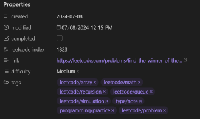
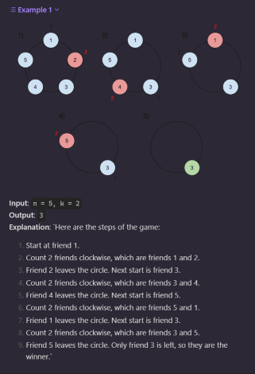
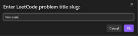
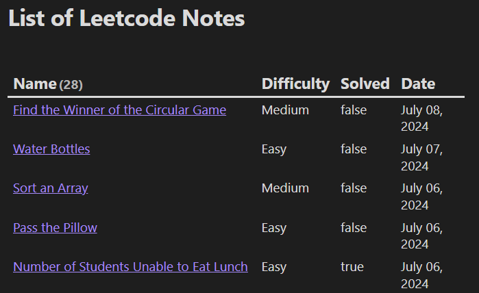

# LeetCode QuickAdd Script for Obsidian

## Table of Contents
- [Introduction](#introduction)
- [Features](#features)
- [Screenshots](#screenshots)
- [Prerequisites](#prerequisites)
- [Installation](#installation)
- [Usage](#usage)
- [Configuration](#configuration)
- [How It Works](#how-it-works)
- [Limitations](#limitations)
- [License](#license)
- [Acknowledgements](#acknowledgements)

## Introduction

The LeetCode QuickAdd Script is an Obsidian plugin script designed to more seamlessly integrate LeetCode problem information into your Obsidian vault. This script leverages the [QuickAdd](https://github.com/chhoumann/quickadd) plugin and a [LeetCode API](https://github.com/alfaarghya/alfa-leetcode-api) to fetch problem details and format them into a structured note, making it easier for users to track their LeetCode progress and study efficiently within Obsidian.

This is my first little coding project :) It aims to streamline the process of documenting LeetCode problems, allowing users to focus on problem-solving rather than manual note-taking.


## Features

- Fetch LeetCode problem details using the problem's title slug
- Automatically format problem statements, examples, constraints, and follow-up questions
- Convert HTML content to Markdown for better compatibility with Obsidian
- Create structured notes with problem metadata, including difficulty and tags
- Format examples as collapsible callouts for better organization
- Include formatted hints as hidden callouts
- Customize tag prefixes for better integration with your existing tag system

## Screenshots

Auto populated properties



Sample Output


Some support for more complex questions



## Prerequisites

Before using this script, ensure you have the following:

1. [Obsidian](https://obsidian.md/) installed on your device
2. The [QuickAdd plugin](https://github.com/chhoumann/quickadd) installed and enabled in your Obsidian vault

## Installation

1. In your Obsidian vault, create a new folder named `scripts` (if it doesn't already exist)
2. Save `leetcode-quickadd.js` in the `scripts` folder
3. Open the QuickAdd plugin settings in Obsidian
4. Create a new Macro and add a "User Script" choice
5. Select the `leetcode-quickadd.js` file as the script for this choice
6. Add a page template for your Macro to use. See my personal example [below](###Using Variables in Your Template) for reference
7. Configure the Macro settings as desired (e.g., output folder for LeetCode notes)

## Usage

1. Trigger the QuickAdd menu in Obsidian
2. Select the LeetCode QuickAdd Macro you created
3. Enter the title slug of the LeetCode problem when prompted
   (e.g., for the problem "Two Sum" at https://leetcode.com/problems/two-sum/, enter "two-sum")
   
   
   
5. The script will fetch the problem details and create a new note with the formatted information

## Configuration

You can customize the script behavior by modifying the following settings in the QuickAdd Macro configuration:

- **LeetCode Tag Prefix**: Set a prefix for LeetCode problem/tags (default: "leetcode/")
>[!TIP]
>To change these settings:
>1. Open the QuickAdd plugin settings
>2. Edit the Macro you created for the LeetCode QuickAdd script
>3. Modify the values in the "User Script" choice settings

## How It Works
1. The script prompts the user for a LeetCode problem title slug
2. It sends a request to the LeetCode API to fetch problem details
3. The received HTML content is converted to Markdown
4. Problem information is formatted into a structured note, including:
   - Problem title and ID
   - Difficulty
   - LeetCode problem link
   - Problem statement
   - Examples (as expanded callouts)
   - Constraints (as a callout)
   - Follow-up questions (as a hidden callout)
   - Tags (with customizable prefix)
   - Hints (as hidden callouts)
5. The formatted note is created in the specified Obsidian folder

## Template Variables

The LeetCode QuickAdd script provides several variables that you can use in your note templates. These variables are populated with data fetched from the LeetCode API. Here's a list of currently available variables and their descriptions:

| Variable | Description | Example |
|----------|-------------|---------|
| `{{VALUE:id}}` | The LeetCode problem ID | `1` |
| `{{VALUE:title}}` | The title of the problem | `"Two Sum"` |
| `{{VALUE:difficulty}}` | The difficulty level of the problem | `"Easy"` |
| `{{difficulty}}` | The problem's difficulty | `Easy` |
| `{{link}}` | The URL of the problem | `"https://leetcode.com/problems/two-sum"` |
| `{{VALUE:problemStatement}}` | The full problem statement in Markdown format | (Markdown formatted text) |
| `{{VALUE:tags}}` | A formatted list of problem tags with customizable prefix | `- leetcode/array` |
| `{{VALUE:fileName}}` | A sanitized filename for the note | `1. "Two Sum"` |
| `{{VALUE:formattedHints}}` | Formatted hints as hidden callouts | (Markdown formatted hints) |

### Using Variables in Your Template

To use these variables in your QuickAdd template, surround them with double curly braces. Here's my personal template:

```markdown
---
created: {{DATE}}
modified: 
completed: false
leetcode-index: {{VALUE:id}} 
link: {{VALUE:link}}
difficulty: {{VALUE:difficulty}} 
tags:
{{VALUE:tags}} 
   - programming/practice
   - leetcode/problem
   - your/tags
---
# {{VALUE:title}}

## Problem Statement
{{VALUE:problemStatement}}
## Hints
{{VALUE:formattedHints}}
## Approach

- 
## Solution


## Complexity Analysis

- Time complexity: 
- Space complexity: 

## Reflections
- 
```
Effective tagging and the [Dataview Plugin](https://github.com/blacksmithgu/obsidian-dataview) allow for some cool tracking and filtering of the problems. Check it out:


## Limitations

- Currently untested on mobile
- Due to the large varience in Leetcode questions it sometimes has small formatting issue, particularly with examples and constraints. 
- Probably many more!


## License

This project is licensed under the MPL-2 License - see the [LICENSE](LICENSE) file for details.

## Acknowledgements

- [QuickAdd plugin](https://github.com/chhoumann/quickadd) by Christian B. B. Houmann
- [Alfa Leetcode](https://github.com/alfaarghya/alfa-leetcode-api) by Arghya Das
- [LeetCode](https://leetcode.com/) for providing so many problems 
- [Obsidian](https://obsidian.md/) for the amazing note-taking app

---

Made with ❤️ by Shane Zimmerman

If you find this script helpful, consider starring the repository and sharing it with others!
